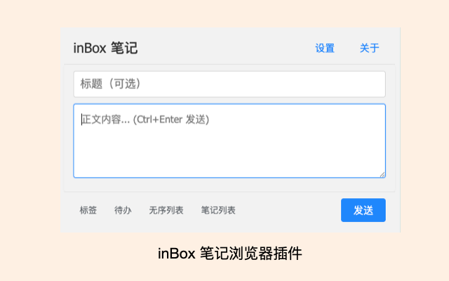

# inBox 笔记 Chrome 扩展

这是一个用于快速发送笔记到 inBox 的 Chrome 扩展。

关于 inBox 笔记，可查看官网：[https://doc.gudong.site/inbox/](https://doc.gudong.site/inbox/)

## 功能特点

- 快速发送笔记到 inBox
- 支持标签、待办和列表格式
- 历史笔记记录
- 历史标签管理
- 支持自定义 API URL
- 支持快捷键发送（Ctrl+Enter 或 Command+Enter）

## 安装方法

### 方法一：从 Chrome 网上应用店安装（推荐）

1. 访问 [Chrome 网上应用店](https://chromewebstore.google.com/detail/inbox-%E7%AC%94%E8%AE%B0/icgkklceeijpkpgkmckjmdailmncnifi?authuser=0&hl=en)
2. 点击"添加至 Chrome"按钮
3. 在弹出的确认框中点击"添加扩展程序"

### 方法二：开发者模式安装

1. 下载本扩展的源代码
2. 打开 Chrome 浏览器，进入扩展程序页面（chrome://extensions/）
3. 开启右上角的"开发者模式"
4. 点击"加载已解压的扩展程序"
5. 选择下载的扩展文件夹

## 使用方法

1. 点击 Chrome 工具栏中的扩展图标
2. 首次使用时，需要设置 inBox API Token：
   - 点击"设置"按钮
   - 输入您的 API Token 或完整的 API URL
   - 点击"保存"按钮

3. 发送笔记：
   - 在标题框中输入笔记标题（可选）
   - 在内容框中输入笔记内容
   - 使用工具栏按钮添加标签、待办或列表
   - 点击"发送"按钮或使用快捷键 Ctrl+Enter（Windows）/ Command+Enter（Mac）发送

4. 查看历史笔记：
   - 点击"笔记列表"按钮
   - 点击历史笔记可以重新编辑
   - 点击笔记右侧的 × 按钮可以删除笔记

5. 管理标签：
   - 点击"标签"按钮查看历史标签
   - 点击标签可以快速插入到编辑区
   - 使用"清空标签"按钮可以清除所有历史标签

## 快捷键

- `Ctrl+Enter`（Windows）或 `Command+Enter`（Mac）：快速发送笔记

## 隐私政策

我们重视您的隐私。请查看我们的[隐私政策](privacy.md)，了解我们如何：
- 收集和使用您的数据
- 保护您的隐私
- 存储和处理信息
- 保障您的权利

## 注意事项

- 请妥善保管您的 API Token
- 本地存储的笔记和标签数据仅保存在浏览器中
- 建议定期清理历史记录以保持扩展运行流畅

## 技术支持

如有问题或建议，请访问 [inBox 文档](https://doc.gudong.site/inbox/) 或提交 Issue。

## 许可证

MIT License 